```mermaid
flowchart TD
  A[Dinner Conundrum] --> B(Go shopping)
  B --> C{What do I eat?}
  C -->|Outdoor Cookout| D[Buy steak, corn, and potatoes]
  C -->|Healthy Eating| E[Buy salad and chicken]
  C -->|College Life| F[Buy ramen and cry 😢]
```

## Entity Description
* Dinner Conundrum
  * This is a title serving to start the Diagram and leads to the first step
* Go Shopping
  * The first step introducing "the player" to what is happening next, which is go to the grocery store.
* What do I eat?
  * Introduces the choice of what to buy and then has flows into the decisions
* Outdoor Cookout
  * This is option for 1 for the choice
* Healthy Eating
  * This is option 2
* College Life
  * This is option 3 with added humor
